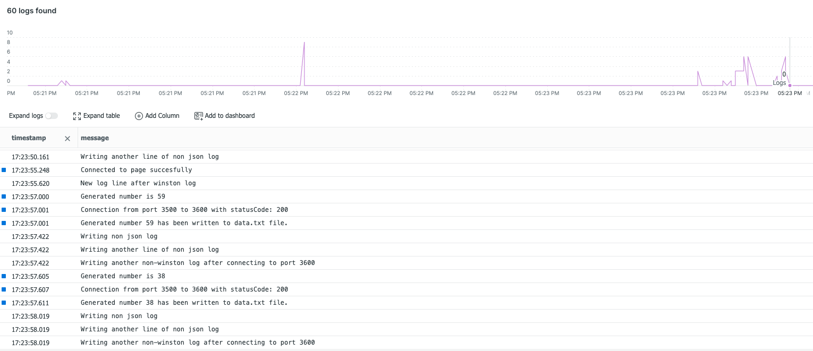

# node-otel-example

A node example app that sends OTEL traces and logs to New Relic using an OTEL collector.

## Overview

### Description

This is a simple node app that generates a random number then displays the generated number. Logs are generated using winston logging library as well as using the fs File System library to manually write non json logs. The combination of these different log types are processed using OTEL and enriched with some metadata and then exported to New Relic.

The OTEL collector offers several options for receivng logs e.g reading from a file using Fluent, syslogs, etc. For this example we will be reading logs form a local file. We will write the logs locally on the host where the app will run, then we will mount the logs to an OTEL collector docker container. 

Below is a basic architecture of this app. 

### Installation

Clone this repo 
 `git clone https://github.com/Dkairu/node-otel-example.git`

Go into the directory
  `cd node-otel-example`

Install the dependencies 
  `npm install`

Start the OTEL collector and mount the configuration file plus the logs location. Please note a New Relic license key is required and should be saved on the host machine as an env variable `NEW_RELIC_LICENSE_KEY`
 
   `docker run -d -v $(pwd)/src/utils/otel-collector-config.yml:/etc/otelcol-contrib/config.yaml -v $(pwd)/src/logs/app.logs:/etc/otelcol-contrib/app-logs/app.logs -e NEW_RELIC_LICENSE_KEY=$NEW_RELIC_LICENSE_KEY -p 4318:4318 otel/opentelemetry-collector-contrib:latest`

Start the app 
  `npm start`

Open the app running on http://localhost:3500

View your logs in New Relic UI
